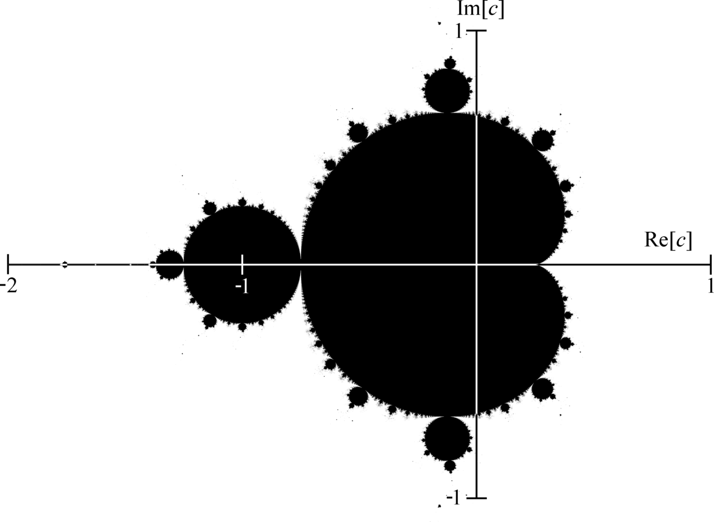

# Визуализация точек множества Мандельброта

## Введение
  <p style="font-size: 20px;">Множество Мандельброта - множество точек c на комплексной плоскости,
  для которых рекурректное соотношение z<sub>n+1</sub> = z<sub>n</sub><sup>2</sup> + c при z<sub>0</sub> = 0 задаёт ограниченную последовательность. Оно является одним из самых известных фракталов и может быть визуализировано следующим образом:</p>
  


## Цель работы
<p style="font-size: 20px;">Оптимизация расчёта точек множества Мандельброта.</p>

## Ход работы

<p style="font-size: 20px;">Будем измерять время 100 итераций цикла в каждой версии(непосредственно алгоритма расчёта, исключая время рисования картинки) с помощью фукнции __rdtsc. В каждой версии присутствует volatile переменная, чтобы компилятор не свернул функцию до одной команды ret.</p>

## Системные характеристики
<p style="font-size: 20px;">Процессор: AMD Ryzen™ 7 7435HS, 3.1 Ггц</p>
<p style="font-size: 20px;">Версия компилятора: g++ 13.3.0</p>
<p style="font-size: 20px;">Поддержка AVX2 инструкций</p>

## Версия 1: базовая

<p style="font-size: 20px;">Алгоритм базовой версии выглядит следующим образом:</p>

```
uint64_t CalculateNoOpt (void)
{
    const int nMax = 256;
    const float dx = 1/800.f, dy = 1/800.f;
    const float r2Max = 100.f;
    const float xC = 0.f, yC = 0.f, scale = 1.f;

    int num_of_cycles = 100;
    int res = 0;

    uint64_t start = __rdtsc();
    volatile int result = 0;

    for (; res < num_of_cycles; res++)
    {
        for (int iy = 0; iy < 600; iy++)
        {
            float x0 = ((          - 400.f) * dx + ROI_X + xC) * scale,
                  y0 = (((float)iy - 300.f) * dy + ROI_Y + yC) * scale;

            for (int ix = 0; ix < 800; ix++, x0 += dx)
            {
                float X = x0,
                      Y = y0;

                int N = 0;

                for (; N < nMax; N++)
                {
                    float x2 = X * X,
                          y2 = Y * Y,
                          xy = X * Y;

                    float r2 = x2 + y2;

                    if (r2 >= r2Max)
                        break;
                    X = x2 - y2 + x0;
                    Y = xy + xy + y0;
                }

                result += N;
            }

        }
    }

    uint64_t end = __rdtsc();

    return (end - start) / num_of_cycles;
}
```

<p style="font-size: 20px;">Проведём измерения:</p>

<table style="width: 70%; border-collapse: collapse; font-size: 20px;">
  <tr>
    <th>-O0, с</th>
    <th>-O1, с</th>
    <th>-O2, с</th>
    <th>-O3, с</th>
  </tr>
  <tr>
    <td>23.489 ± 0.002</td>
    <td>8.439 ± 0.001</td>
    <td>8.290 ± 0.004</td>
    <td>8.282 ± 0.004</td>
  </tr>
</table>


## Версия 2: на массивах

<p style="font-size: 20px;">Основная идея заключается в том, чтобы позволить компилятору оптимизировать код таким образом, чтобы обрабатывалось по несколько точек за раз. Так выглядит код версии на массивах:</p>

```
uint64_t CalculateArrayOpt (void)
{
    const int nMax = 256;
    const float dx = 1/800.f, dy = 1/800.f;
    const float r2Max = 100.f;
    const float xC = 0.f, yC = 0.f, scale = 1.f;

    int num_of_cycles = 100;
    int res = 0;

    uint64_t start = __rdtsc();

    volatile int result[4] = {};

    for (; res < num_of_cycles; res++)
    {
        float xC = 0.f, yC = 0.f, scale = 1.f;

        for (int iy = 0; iy < 600; iy++)
        {
            float x0 = ((          - 400.f) * dx + ROI_X + xC) * scale,
                  y0 = (((float)iy - 300.f) * dy + ROI_Y + yC) * scale;

            for (int ix = 0; ix < 800; ix += 4, x0 += dx * 4)
            {
                float X0[4] = {x0, x0 + dx, x0 + dx*2, x0 + dx*3};
                float Y0[4] = {y0, y0,      y0,        y0};

                float X[4] = {}; for (int i = 0; i < 4; i++) X[i] = X0[i];
                float Y[4] = {}; for (int i = 0; i < 4; i++) Y[i] = Y0[i];

                int N[4] = {0, 0, 0, 0};

                int n = 0;
                for (; n < nMax; n++)
                {
                    float x2[4] = {}; for (int i = 0; i < 4; i++) x2[i] = X[i] * X[i];
                    float y2[4] = {}; for (int i = 0; i < 4; i++) y2[i] = Y[i] * Y[i];
                    float xy[4] = {}; for (int i = 0; i < 4; i++) xy[i] = X[i] * Y[i];

                    float r2[4] = {}; for (int i = 0; i < 4; i++) r2[i] = x2[i] + y2[i];

                    int cmp[4] = {};
                    for (int i = 0; i < 4; i++) if (r2[i] <= r2Max) cmp[i] = 1;

                    int mask = 0;
                    for (int i = 0; i < 4; i++) mask |= (cmp[i] << i);
                    if (!mask) break;

                    for (int i = 0; i < 4; i++) N[i] = N[i] + cmp[i];

                    for (int i = 0; i < 4; i++) X[i] = x2[i] - y2[i] + X0[i];
                    for (int i = 0; i < 4; i++) Y[i] = xy[i] + xy[i] + Y0[i];
                }

                for (int i = 0; i < 4; i++) result[i] += N[i];
            }
        }
    }

    uint64_t end = __rdtsc();

    return (end - start) / num_of_cycles;
}
```
<p style="font-size: 20px;">Проведём измерения:</p>

<table style="width: 70%; border-collapse: collapse; font-size: 20px;">
  <tr>
    <th>-O0, c</th>
    <th>-O1, c</th>
    <th>-O2, c</th>
    <th>-O3, c</th>
  </tr>
  <tr>
    <td>52.980 ± 0.003</td>
    <td>11.260 ± 0.004</td>
    <td>7.783 ± 0.004</td>
    <td>4.101 ± 0.003</td>
  </tr>
</table>


## Версия 3: c использованием AVX2 инструкций

<p style="font-size: 20px;">Перепишем весь код на интринсиках. Можем записывать по 8 точек в переменную типа __m256 и обрабатывать за одну итерацию:</p>

```
uint64_t CalculateOpt (void)
{
    const int nMax = 256;
    const float dx = 1/800.f, dy = 1/800.f;
    const float xC = 0.f, yC = 0.f, scale = 1.f;

    __m256 r2Max = {100.f, 100.f, 100.f, 100.f, 100.f, 100.f, 100.f, 100.f};
    __m256 _3210 = _mm256_set_ps(7.0f, 6.0f, 5.0f, 4.0f, 3.0f, 2.0f, 1.0f, 0.0f);

    int num_of_cycles = 100;
    int res = 0;

    uint64_t start = __rdtsc();

    volatile int result = 0;

    for (; res < num_of_cycles; res++)
    {
        for (int iy = 0; iy < 600; iy++)
        {
            float x0 = ((          - 400.f) * dx + ROI_X + xC) * scale,
                  y0 = (((float)iy - 300.f) * dy + ROI_Y + yC) * scale;

            for (int ix = 0; ix < 800; ix += 8, x0 += dx * 8)
            {
                __m256 DX = {}; DX = _mm256_set1_ps(dx); DX = _mm256_mul_ps(DX, _3210);

                __m256 X0 = {}; X0 = _mm256_set1_ps(x0); X0 = _mm256_add_ps(X0, DX);
                __m256 Y0 = {}; Y0 = _mm256_set1_ps(y0); 

                __m256 X = {}; X = _mm256_add_ps(X, X0);
                __m256 Y = {}; Y = _mm256_add_ps(Y, Y0);

                __m256i N = {};

                for (int n = 0; n < nMax; n++)
                {
                    __m256 x2 = {}; x2 = _mm256_mul_ps(X, X);
                    __m256 y2 = {}; y2 = _mm256_mul_ps(Y, Y);
                    __m256 xy = {}; xy = _mm256_mul_ps(X, Y);

                    __m256 r2 = {}; r2 = _mm256_add_ps(x2, y2);

                    __m256 cmp = {}; cmp = _mm256_cmp_ps(r2, r2Max, _CMP_LE_OQ);

                    int mask = _mm256_movemask_ps(cmp);
                    if (!mask) break;

                    __m256i cmp_int = _mm256_castps_si256(cmp);
                    N = _mm256_add_epi32(N, cmp_int);

                    X = _mm256_sub_ps(x2, y2); X = _mm256_add_ps(X, X0);
                    Y = _mm256_add_ps(xy, xy); Y = _mm256_add_ps(Y, Y0);
                }

                result += _mm256_extract_epi32(N, 0);
            }
        }
    }

    uint64_t end = __rdtsc();

    return (end - start) / num_of_cycles;
}
```
<p style="font-size: 20px;">Проведём измерения:</p>
<table style="width: 70%; border-collapse: collapse; font-size: 20px;">
  <tr>
    <th>-O0, c</th>
    <th>-O1, c</th>
    <th>-O2, c</th>
    <th>-O3, c</th>
  </tr>
  <tr>
    <td>9.275 ± 0.002</td>
    <td>1.158 ± 0.004</td>
    <td>1.148 ± 0.004</td>
    <td>1.146 ± 0.003</td>
  </tr>
</table>


## Сравнение времени исполнения (с -O3)
<table style="width: 70%; border-collapse: collapse; font-size: 20px;">
  <tr>
    <th>Версия 1</th>
    <th>Версия 2</th>
    <th>Версия 3</th>
  </tr>
  <tr>
    <td>x</td>
    <td>2.0x</td>
    <td>7.3x</td>
  </tr>
</table>

## Результат
<p style="font-size: 20px;">Получаем ускорение последней версии относительно первой(обе скомпилированы с -О3) примерно в 7.3 раз.</p>
